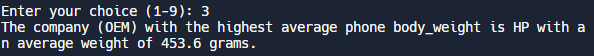

# Alt_lang_proj_2024_Ruby
### Which programming language and version did you pick?
I chose my the latest version of Ruby as my programming language (Ruby + Devkit 3.2.3-1).
### Why did you pick this programming language?
I did some preliminary research before starting the assignment and found that Ruby was extremely suited for data cleaning. My initial plan was to use Java as I have some, albeit minimal experience with the language, but ultimately decided to push myself out of my comfort zone to use Ruby.
### How your programming language chosen handles: object-oriented programming, file ingestion, conditional statements, assignment statements, loops, subprograms (functions/methods), unit testing and exception handling. If one or more of these are not supported by your programming language, indicate it as so. 
Object-Oriented Programming (OOP)  
From my understanding,Ruby is a purely object-oriented language, everything in Ruby is an object, including primitive types such as numbers and even true, false, and nil. Ruby supports the core OOP principles such as inheritance, encapsulation, and polymorphism.  

File Ingestion  
Ruby provides straightforward file ingestion ability through its File class and other IO classes. You can read from or write to files using simple methods. Ruby can handle different modes of file operations (e.g., reading, writing, appending) and can manage file pointers for more complex file manipulation tasks. 

Conditional Statements  
Ruby supports conditional statements such as if, else, elsif, and unless. These can be used for branching logic based on conditions.  

Assignment Statements  
Ruby uses = for assignment statements, allowing you to assign values to variables. Ruby variables do not require explicit type declaration and can hold data of any type. Ruby also supports parallel assignment, allowing multiple variables to be assigned values in a single statement.  

Loops  
Ruby provides several loop constructs including while, until, for, and the iteration methods like .each, .map, and .times for arrays, hashes, and other enumerable collections.  

Subprograms (Functions/Methods)  
In Ruby, subprograms are defined as methods. Methods are defined using the def keyword and can belong to objects (instance methods) or classes (class methods). Ruby methods can accept arguments, including default arguments, and return values.  

Unit Testing  
Ruby supports unit testing through several libraries, with the most prominent being RSpec and Minitest. These libraries provide a way to write and run tests for your Ruby code, encouraging test-driven development (TDD) practices. They offer a rich set of assertions to check your code's functionality.

### List out 3 libraries you used from your programming language (if applicable) and explain what they are, why you chose them and what you used them for.
1. CSV 
The CSV library is part of Ruby's standard library and provides a complete interface to handle CSV files. It allows for reading from and writing to CSV files, as well as manipulating CSV data in an easy and intuitive way. We are working with data that is stored in CSV format. The CSV library is a good choice for this task because it's specifically designed to work with CSV files, making it unnecessary to reinvent the wheel for CSV parsing and generation. I used the CSV library to read data from CSV files, filter and transform this data (e.g., searching by OEM, cleaning data), and then output the results to new CSV files or for further processing. This includes operations like reading the cleaned_cells.csv file and appending new rows to it. 
2. Minitest 
Minitest is a testing suite for Ruby that provides a complete suite of testing facilities supporting TDD (Test-Driven Development), BDD (Behavior-Driven Development), mocking, and benchmarking. It's part of Ruby's standard library.Unit testing is a necessary part of this assignment, ensuring that my code behaves as expected. Minitest is chosen for its simplicity and integration with Ruby, offering the necessary features without the need for external dependencies. I used Minitest to write unit tests for your data processing functions.
3. Ostruct 
An OpenStruct (Ostruct) is a data structure, similar to a Hash, that allows the definition of arbitrary attributes with their accompanying values. This is accomplished by using Ruby's metaprogramming to define methods on the class itself. This was necessary for the unit tests that I created to set values necessary for comparison with the test values.
### Answer the following questions (and provide a corresponding screen showing output answering them):
### What company (oem) has the highest average weight of the phone body? 
The company with the highest average weight of the phone body is Lenovo with an average weight of 292.6 grams
  
### Was there any phones that were announced in one year and released in another? What are they? Give me the oem and models.
 There were 4 phones that were announced one year and released another:
1. OEM: Motorola, Model: One Hyper A:2019 R:2020
2. OEM: Motorola, Model: Razr 2019 A:2019 R:2020
3. OEM: Xiaomi, Model: Redmi K30 5G A:2019 R:2020
4. OEM: Xiaomi, Model: Mi Mix Alpha A:2019 R:2020

 
### How many phones have only one feature sensor?  
There are 432 phones with only one feature sensor 
  
### What year had the most phones launched in any year later than 1999?  
The year 2019 had the most phone launches after 1999 with 304 launches
 
### Notes:  
1. Four of the functions that were put into the menu are related to the Report questions with output shown above.
2. Not all of the unit tests function as intended but they were created to the best of my ability, I have commented which ones do not work. Additionally, they are organized with the three mentioned in the assignment specifications first, followed by the menu functions I created in order.
3. In order to verify the unit tests, it is recommended that you comment out the menu spanning lines 302-269
3. The cleaned_cells.csv file was created as a separate file from the cells.csv provided and can be viewed/downloaded
4. All functionality has been thoroughly tested and confirmed via replit
5. For the purpose of unit testing, an additional line has been added to the replit gemfile (gem 'minitest')
6. In order to generate the cleaned file a comment has been left in the section that needs to be uncommented.
7. txt files generated from various functions can be deleted and regenerated to see the file output

